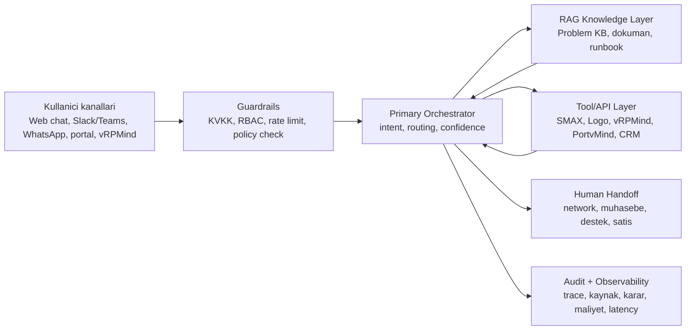

# VMind Agentic Operations Hub

Calisma adi: **VMind Agentic Operations Hub**.

Amac: VMind'in mevcut guclu taraflarini, yani PortvMind cloud operasyonlari, vRPMind surec yonetimi, Problem KB/runbook dokumantasyonu, SMAX problem sinyalleri, Logo muhasebe akislari ve kurum ici dokuman hafizasini tek bir RAG + agent orkestrasyon katmaninda birlestirmek.

Bu fikir klasik chatbot degil. Dogru konumlandirma: **dokumandan cevap veren, sistemden veri okuyan, uygun durumda islem baslatan ve riskli durumda insana temiz baglamla devreden operasyon asistani**.

## Neden VMind icin mantikli?

- VMind zaten cloud, managed service ve is sureci tarafinda gercek operasyon verisine sahip.
- vRPMind, public sayfada satis otomasyonu ve surec yonetimini departmanlar arasi workflow, gorev, kaynak, termin, faturalama, hedef takibi ve dashboard mantigi ile anlatiliyor.
- PortvMind console yuzeyi compute, network, volume, backup, Kubernetes, load balancer, object storage, quota, support, API access, IAM ve billing gibi operasyonel modullere sahip.
- Network ekibi tekrar eden problemleri Problem KB'de dokumante ederek dogrulanmis cozum hafizasi uretebilir.
- SMAX ticketlari cozum kaynagi degil; hangi problemlerin siklastigini gosteren oncelik sinyalidir.
- Muhasebe Logo kullandigi icin fatura, cari, tahsilat, mutabakat ve masraf akislari icin net tool adaylari var.
- Kurum ici dokumanlar, prosedurler, runbooklar ve problem KB iyi islenirse VMind'e ozel bir bilgi avantaji olusur.

## Urun pozisyonu

**Tek cumle:** VMind Agentic Operations Hub, calisanlarin ve musterilerin VMind sistemleriyle dogal dil uzerinden guvenli, kaynakli ve aksiyon alabilir sekilde calismasini saglayan kurumsal AI operasyon katmanidir.

Rakipten ayrisma noktasi:

- Orbina tarafindaki "Bilgi -> Aksiyon -> Devir" mantigi korunur.
- VMind tarafinda buna cloud operasyon bilgisi, vRPMind surec motoru, Problem KB/runbook omurgasi, SMAX trend sinyalleri ve Logo finans gercekligi eklenir.
- Yani sadece musteri deneyimi asistani degil, **IT + cloud + surec + finans operasyon yardimcisi** olur.

## Katman modeli

## Progressif urun paketleri

### Katman 1 - Bilgi

Sadece Problem KB, dokuman ve runbook hafizasi uzerinden kaynakli cevap verir.

Ornekler:

- "Bu hata daha once nasil cozulmus?"
- "vRPMind'de teklif sureci hangi asamada ilerler?"
- "Musteriye VPS yedekleme politikasini nasil anlatirim?"
- "Logo'da fatura mutabakati icin hangi belge gerekir?"

### Katman 2 - Okuma ve sorgulama

Yetkili sistemlerden read-only veri ceker.

Ornekler:

- SMAX problem trend sinyalleri ve ilgili KB maddesi durumu.
- PortvMind kota, instance, volume, backup veya floating IP durumu.
- vRPMind surec asamasi, sahip, termin, bekleyen gorev.
- Logo cari/fatura durum ozeti.

### Katman 3 - Kontrollu aksiyon

Kullanici onayi ve audit ile islem baslatir.

Ornekler:

- Problem KB maddesi taslagi olusturma; gerekiyorsa SMAX devri icin sadece destek talebi taslagi hazirlama.
- vRPMind'de gorev acma, sorumlu atama, SLA hatirlatma.
- Logo tarafinda muhasebe kaydi degil, once taslak/onerilen islem olusturma.
- PortvMind icin backup gorevi veya destek talebi taslagi olusturma.

### Katman 4 - Agentic operasyon

Birden fazla sistemi sirali ve kuralli calistirir.

Ornek:

1. Musteri "sunucum yavas" der.
2. Asistan PortvMind kaynak durumunu okur.
3. Problem KB/runbook maddesini getirir.
4. SMAX sinyallerini yalnizca problemin tekrar ettigini gostermek icin kullanir.
5. Cozum bulunmazsa network ekibine temiz ozetle devir yapar.
6. vRPMind'de musteri surecine not duser.

## Ilk hedef persona'lar

- Network ekibi: problem KB dokumantasyonu, tekrar eden incident sinyalleri, runbook arama.
- Muhasebe: Logo dokumanlari, fatura/cari surec sorulari, mutabakat kontrol listesi.
- Satis ve operasyon: vRPMind surecleri, teklif ve musteri takip bilgisi.
- Cloud operasyon: PortvMind kaynak, kota, backup, network, Kubernetes ve support akis bilgisi.
- Stajyer / yeni calisan: kurum ici bilgiye guvenli erisim ve onboarding.

## Ilgili notlar

- [01 - Orbina ve VMind Firsat Analizi](01-orbina-vmind-analysis.md)
- [02 - RAG ve Agent Mimari Semasi](02-rag-agent-architecture.md)
- [03 - Veri Kaynaklari ve Izin Matrisi](03-data-permissions.md)
- [04 - MVP Backlog ve Yol Haritasi](04-mvp-roadmap.md)
- [05 - Bot Davranis Kurallari ve Degerlendirme](05-bot-guardrails-eval.md)
