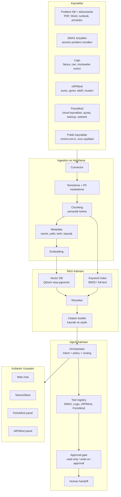
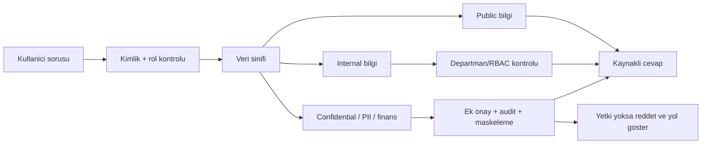

# RAG ve Agent Mimari Semasi

## Onemli ayrim

RAG'de genelde modeli "egitmek" yerine kaynaklari **indeksleriz**. Model sabit kalir; bot soruya cevap verirken ilgili Problem KB, dokuman, runbook veya sistem kaydini getirir ve cevabi bu kaynaklara dayandirir.

Fine-tuning daha sonra dusunulebilir, ama ilk MVP icin hedef:

- Problem KB, dokuman ve runbooklari temizlemek.
- SMAX ticketlarini cozum kaynagi degil, anonim problem trend sinyali olarak ayri islemek.
- Parcalara ayirmak.
- Embedding ile vector store'a koymak.
- Yetki ve kaynak metadatasi eklemek.
- Sorulari kaynakli cevaplamak.
- Gerekirse tool/API cagirmak.

## Yuksek seviye mimari

## Agent rolleri

### 1. Router Agent

Gorev:

- Soru tipini anlar.
- Hangi kaynak ve hangi tool gerekli karar verir.
- Yetki kontrolu yapar.
- Dusuk guven durumunda insana devreder.

### 2. Knowledge Agent

Gorev:

- Problem KB, dokuman ve runbooklardan kaynakli cevap uretir.
- Cevapta kaynak belirtir.
- Kaynak yoksa uydurmaz.

### 3. SMAX Signal Agent

Gorev:

- Tekrar eden problem kategorilerini ve frekans sinyallerini bulur.
- Eksik Problem KB maddesi veya guncelleme ihtiyacini onerir.
- Ticket metninden otomatik cozum uretmez; gerekiyorsa ticket acma/guncelleme taslak olarak kalir.

### 4. PortvMind Cloud Agent

Gorev:

- Compute, volume, backup, network, Kubernetes, load balancer, object storage, quota ve billing sorularini cevaplar.
- Ilk MVP'de dokuman + read-only API.
- Riskli aksiyonlarda kullanici onayi ister.

### 5. vRPMind Process Agent

Gorev:

- Surecin hangi asamada oldugunu aciklar.
- Bekleyen gorev, sahip, SLA ve sonraki adimlari ozetler.
- Gerekirse gorev taslagi olusturur.

### 6. Logo Finance Agent

Gorev:

- Muhasebe sureci sorularini cevaplar.
- Fatura/cari/mutabakat durumunu read-only ozetler.
- Muhasebe kaydi gibi kritik islemleri otomatik yapmaz; taslak ve onay akisina sokar.

## Yetki modeli

## Chunk metadatasi

Her chunk icin onerilen alanlar:

- `source_system`: kb, smax, logo, vrpmind, portvmind, website, manual, policy.
- `source_uri`: dosya yolu, URL, KB id, ticket-signal id veya API resource id.
- `department`: network, finance, sales, cloud, support, hr.
- `doc_type`: kb_article, runbook, ticket, policy, invoice_process, product_doc, faq.
- `sensitivity`: public, internal, confidential, pii, financial.
- `owner`: dokuman sahibi ekip.
- `permission_group`: LDAP/SSO grubu.
- `effective_date`: gecerlilik tarihi.
- `last_verified`: son dogrulama tarihi.
- `chunk_type`: definition, procedure, troubleshooting, policy, api_reference, decision.
- `entities`: musteri, servis, modul, hata kodu, urun, kaynak tipi.
- `confidence_policy`: kaynak yoksa cevap verme / insana devret.

## Retrieval kurallari

- Kaynak yoksa "bilmiyorum" de ve hangi kaynagin eksik oldugunu soyle.
- Ticket metninden cozum uretme; ticketlari sadece problem onceligi ve KB eksigi sinyali olarak kullan.
- Logo ve finans tarafinda otomatik aksiyon yerine onayli taslak kullan.
- PortvMind operasyonunda delete, release, password, key, payment, permission gibi islemler icin onay zorunlu.
- SMAX sinyal ozetlerinde kisi verisi maskele.
- Cevaplar kaynak linki, dosya adi, ticket id veya modul adiyla izlenebilir olmali.
