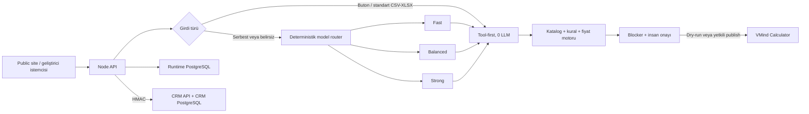

# Geliştirici devir paketi

Bu paket, VMind Teklif Ajanı'nı kaynak kodu bilmeyen bir ekibin API/Postman ve
Docker üzerinden devralabilmesi için hazırlanmıştır. Public Cloud kaynak açma
işlemi bu sürümün parçası değildir; teslim edilen sınır **ihtiyaç toplama →
doğrulanmış fiyat → onay → Calculator teklifi → CRM/telemetri** akışıdır.

## Teslim edilen sözleşmeler

| Dosya | Amaç |
|---|---|
| `docs/openapi.json` | 20 HTTP işlemin OpenAPI 3.1 sözleşmesi |
| `docs/postman/VMind-Teklif-Ajani.postman_collection.json` | Çalıştırılabilir dry-run API örnekleri |
| `docs/postman/VMind-Local.postman_environment.json` | Secret içermeyen örnek ortam |
| `docker-compose.yml` + `Dockerfile` | Salt-okunur, root olmayan uygulama konteyneri |
| `openclaw-vmind-crm/sql/` | Sürümlü PostgreSQL şeması ve migration'lar |
| `docs/postgresql-schema.md` | Kimlik, ajan, kota, teklif ve CRM veri modeli |
| `docs/model-routing-and-cost.md` | Tool-first, model katmanı ve exact cache sözleşmesi |
| `docs/operations-runbook.md` | Health, alarm, yedek, restore ve secret rotasyonu |
| `docs/test-report.md` | Kabul kapıları ve bilinen dış aktivasyonlar |

`npm run handoff:verify`, OpenAPI yollarını, benzersiz operationId'leri,
Postman kapsamını ve teslim ortamında gerçek anahtar bulunmadığını CI'da denetler.

## Çalışma mimarisi



Model; fiyat, productCode veya yayın kararı üretmez. Model yalnız yapılandırılmış
ihtiyaç çıkarımı ve zor tasarım planında kullanılır. Katalog doğrulaması,
fiyatlama, ağ/yedek mutabakatı ve yayınlama tool katmanındadır.

## Kimlik ve kota seçimi

Public müşteri sitesi için PortVMind login gerekmez:

```ini
WEB_AUTH_MODE=public-guest
WEB_PUBLIC_IP_HASH_SECRET=<en az 32 rastgele karakter>
TURNSTILE_SITE_KEY=<site key>
TURNSTILE_SECRET_KEY=<secret key>
TURNSTILE_EXPECTED_HOSTNAME=teklif.sirketiniz.com
WEB_PRIVACY_NOTICE_VERSION=2026-08-14
```

Tarayıcı `POST /api/auth/login` ile ayrı HttpOnly ziyaretçi oturumu alır.
Turnstile ve IP-HMAC limitleri akış başlangıcında uygulanır; ham IP PostgreSQL'e
yazılmaz. Telefon/CRM kaydı yalnız `privacyConsent: true` ve bildirim sürümüyle
oluşur.

Sunucu-sunucu entegrasyonunda cookie yerine iptal edilebilir servis anahtarı:

```http
Authorization: Bearer <WEB_SERVICE_API_KEY>
```

Bu kimlik public müşteriye verilmez ve varsayılan olarak kalıcı teklif yayınlama
yetkisi taşımaz. Admin ve monitor anahtarları ayrıca üretilir; hiçbir anahtar
başka amaç için tekrar kullanılmaz.

## İlk kurulum sırası

1. Secret manager içinde OpenRouter, service, admin, monitor, CRM HMAC,
   Turnstile ve PostgreSQL değerlerini ayrı ayrı üretin. `.env` Git'e girmez.
2. PostgreSQL'i genel ağa açmadan iki veritabanı hazırlayın:
   `vmind_runtime` (Calculator) ve `vmind` (CRM). Gerekirse aynı kümede olabilir,
   ancak ayrı rol/DB yetkileri korunmalıdır.
3. Şemayı uygulama açılışından **ayrı** migration adımıyla kurun:

   ```bash
   cd openclaw-vmind-crm
   VMIND_DATABASE_URL='postgres://...' npm run db:migrate
   VMIND_DATABASE_URL='postgres://...' npm run db:verify
   ```

   Runtime/gateway migration çalıştırmaz; yalnız beklenen şemayı doğrular.
4. Calculator için sabit host-içi Docker ağını ve PostgreSQL bind adresini
   `docs/phase2-postgres.md` sözleşmesine göre hazırlayın.
5. `vmind-calculator/.env.example` dosyasını secret manager çıktılarıyla
   doldurup `docker compose up -d --build` çalıştırın.
6. TLS'i Caddy/nginx üzerinde sonlandırın. Uygulama portu yalnız
   `127.0.0.1:8080` üzerinde kalmalıdır.
7. `GET /api/health/live`, monitor anahtarıyla `GET /api/health/ready`,
   `npm run inventory:check` ve Postman dry-run koleksiyonunu doğrulayın.
8. İlk doğrulamada `WEB_ALLOW_PUBLISH=0` bırakın. Dry-run kabul edildikten sonra
   açık değişiklik kaydıyla `WEB_ALLOW_PUBLISH=1` yapın. Servis hesabına ayrıca
   yayın izni gerekmiyorsa `WEB_SERVICE_ALLOW_PUBLISH=0` kalır.
9. Backup, offsite restic, restore drill ve monitor timer'larını
   `docs/operations-runbook.md` üzerinden etkinleştirin.

## API tüketim akışı

1. Public tarayıcı login/cookie alır; makine istemcisi service Bearer kullanır.
2. Standart seçimler `POST /api/flow/guided`; serbest ihtiyaç
   `POST /api/flow` ile başlar.
3. Dönen `sessionId`, `GET /api/flow/{sessionId}?wait=25000` ile uzun yoklanır.
4. `state=waiting` ve `gate` geldiğinde aynı `gate.id`, answer isteğine verilir:
   - `clarify`: soru metni → cevap nesnesi,
   - `questions`: `{ruleId, answer?}` dizisi,
   - `approve`: `{approved, publish}`.
5. `publish:false` güvenli dry-run'dır. `publish:true` yalnız global publish,
   kimlik yetkisi, sıfır blocker ve açık insan onayı birlikte sağlanırsa geçer.
6. `state=done` sonucunda fiyat ve varsa Calculator `shareUrl` alınır; akış
   `POST /close` ile kapatılır.

Başlatma isteğine ağ seviyesinde belirsiz sonuç geldiyse kör otomatik tekrar
yapmayın; önce yönetim run listesini ve açık akışı kontrol edin. Bu sürümde genel
HTTP idempotency-key defteri yoktur. CRM HMAC akışında `event_id` yinelenen
kayıtları önler.

## Model ve maliyet ayarı

Her tier için OpenRouter hesabında gerçekten erişilebilir model slug'ı açıkça
girilmelidir:

```ini
OPENROUTER_MODEL_FAST=<ucuz ve hızlı yapısal model>
OPENROUTER_MODEL_BALANCED=<orta seviye model>
OPENROUTER_MODEL_STRONG=<zor mimari model>
LLM_DAILY_TOTAL_USD=5
LLM_DAILY_PER_USER_USD=1
VMIND_LLM_CACHE_TTL_SECONDS=86400
```

Router için ayrıca LLM çağrısı yapılmaz. Buton ve tanınan tablo yolu sıfır token
kullanır. Exact cache yalnız PII içermeyen birebir aynı yapısal istekte çalışır;
tool/publish sonucu cache'lenmez. Güçlü model değişiklikleri, gerçek eval JSON
raporu kalite kapısını geçmeden üretime alınmamalıdır.

## Bilinen ölçek sınırı

Yarım akışlar süreç belleğindedir. Tek replika güvenlidir; yeniden başlatma yarım
akışı düşürür fakat PostgreSQL'e bitmiş kayıtları veya VMind teklifini silmez.
Yatay ölçeklemeden önce akış kapıları kalıcı state machine'e taşınmalı veya geçici
olarak sticky session kullanılmalıdır. Public Cloud provisioning ayrı, yüksek
riskli bir capability olarak açık RBAC, idempotency, approval ve rollback ile
sonraki fazda eklenmelidir.

## Devir kabul kontrolü

- `npm ci && npm run typecheck && npm test`
- `npm run inventory:check && npm run handoff:verify && npm run web:build`
- Çalışan sunucuya `VMIND_SMOKE_BASE_URL=... VMIND_SMOKE_SERVICE_KEY=... npm run smoke:api`
- `docker build -t vmind-calculator:acceptance .`
- Tek kullanımlık PostgreSQL'de migration, verify, store ve schema-guard testleri
- Postman guided dry-run: token maliyeti `0`
- Natural dry-run: model tier/reason ve maliyet PostgreSQL'de görünür
- Yetkisiz publish: `403`; blocker varken publish yok
- Yedek checksum + restore drill başarı kaydı
- Eski anahtar kaldırılmadan yeni anahtarla readiness doğrulaması

Bu maddeler geçmeden sistem “devralındı” sayılmamalıdır.

Mevcut HTTP yolları geriye uyumluluk için dondurulmuş `1.0.0` sözleşmesidir.
Alan silme/tip değiştirme gibi kırıcı değişiklikler bu yollar üzerinde yapılmaz;
gerektiğinde yeni `/api/v2` yüzeyi ve ayrı OpenAPI sürümü açılır.
