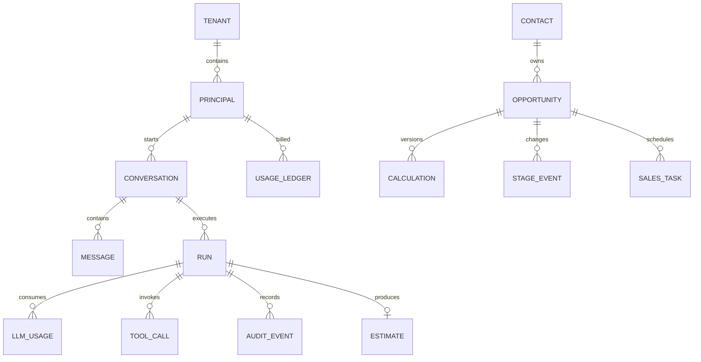

# VMind PostgreSQL veri modeli

Bu şema uygulamanın devredilebilir ana kayıt sistemidir. Airtable zorunlu
değildir. Calculator, ajan telemetrisi, maliyet/kota ve CRM aynı PostgreSQL
kümesinde ayrı şemalarda tutulur; uygulama başlangıçta migration çalıştırmaz,
yalnız beklenen şemayı doğrular.



## Şemalar ve sorumlulukları

| PostgreSQL şeması | İçerik | Ana amaç |
|---|---|---|
| `identity` | tenant, kullanıcı/servis/guest principal, ileride API anahtarları | Kim, hangi tenant adına işlem yaptı? |
| `agent` | konuşma, PII-filtreli mesaj, run, LLM kullanımı, tool çağrısı, audit olayı | Kullanıcı ne sordu, sistem ne yaptı, hangi model çalıştı? |
| `billing` | kota politikası ve değişmez kullanım defteri | Token, USD maliyet ve kullanıcı/tenant limiti |
| `calculator` | ihtiyaç spec'i, tam teklif çıktısı, tutar, yayın durumu | Hangi çalıştırma hangi teklifi üretti? |
| `crm` | contact, opportunity, calculation sürümleri, aşama geçmişi, görev | Satış süreci ve müşteri takibi |

## CRM varlıkları

Telefon numarası doğrudan “müşteri fırsatı” değildir:

- `crm.contacts`: kişi ve açık iletişim/onay durumu. Telefon E.164 biçimindedir.
- `crm.opportunities`: aynı kişinin her ayrı ihtiyacı için yeni satış fırsatı.
- `crm.calculations`: bir fırsatın her Calculator çıktısını yeni sürüm olarak saklar.
- `crm.stage_events`: aşama değişikliklerinin denetim izi.
- `crm.sales_tasks`: takip görevleri.

Bir kişi bugün GPU Cloud, üç ay sonra Backup istediğinde tek `contact` altında iki
ayrı `opportunity` oluşur; teklifler birbirinin üzerine yazılmaz.

## Kullanıcı sorgusu ve LLM verisi

`agent.messages.content_redacted` alanına yazılmadan önce telefon, e-posta ve
tanımlı PII kalıpları filtrelenir. Ham metnin SHA-256 özeti
`content_hash` alanında tutulur. Yönetim API'si yalnız filtreli metni döndürür.

Her `agent.runs` kaydı şu bağları korur:

- principal / kanal / başlama-bitiş zamanı,
- seçilen sağlayıcı, model ve prompt sürümü,
- durum, hata kodu ve yayın sonucu,
- LLM çağrı adedi, input/output token ve USD maliyet,
- kullanılan veya reddedilen tool çağrıları,
- üretilen Calculator teklifinin kimliği ve toplamı.

Bu yapı model yönlendirmesini ve maliyet optimizasyonunu gerçek veriden ölçmeyi
mümkün kılar; “güçlü model mi gerekliydi?” sorusu run bazında incelenebilir.

## Onay ve kişisel veri

Telefon/CRM kaydı ancak site isteğinde açık `privacyConsent: true` geldiğinde
oluşur. Kayıt şu denetim alanlarını taşır:

- `communication_status = opted_in`
- `consent_updated_at`
- `consent_notice_version`
- `consent_source`

Onay sürümü değişmez bir dağıtım değeri (`WEB_PRIVACY_NOTICE_VERSION`) olmalıdır.
Opt-out geldiğinde yeni satış iletişimi durdurulmalı; hukuki saklama ve silme
süreleri VMind'in KVKK politikasında ayrıca tanımlanmalıdır.

## Yönetim erişimi

`/admin` ve `/api/admin/*`, normal müşteri/site çerezini kabul etmez. Ayrı,
en az 32 karakterlik `WEB_ADMIN_API_KEY` Bearer anahtarı gerekir. Anahtar boşsa
yönetim uçları kapalıdır. Yönetim ekranı anahtarı `localStorage` veya cookie'ye
yazmaz; yalnız açık sekmenin React belleğinde tutar.

İlk yönetim uçları:

- `GET /api/admin/overview`
- `GET /api/admin/runs?limit=50`
- `GET /api/admin/runs/{run_id}`
- `GET /api/admin/usage?days=30`
- `GET /api/admin/opportunities?limit=50&stage=Qualified`
- `PATCH /api/admin/opportunities/{opportunity_id}`

Fırsat güncellemesinde yalnız `stage`, `owner` ve `nextFollowUp` kabul edilir.
Aşama değişikliği `crm.stage_events` tablosuna `admin-api` gerekçesiyle yazılır.

## Migration ve çalışma zamanı sınırı

Migration dosyaları `openclaw-vmind-crm/sql/` altındadır. Uygulama/gateway
çalışma zamanı şema yazamaz. Şema değişikliği yalnız açık yönetim adımıyla:

```bash
cd openclaw-vmind-crm
npm run db:migrate
npm run db:verify
```

Son yönetim görünümü migration'ı
`005_tenant_safe_admin_reporting.sql` dosyasıdır. `agent.run_overview` içine
`tenant_id` ekleyerek bütün admin sorgularında tenant filtresini zorunlu kılar.

## Örnek API çıktısı

```json
{
  "runId": "9b3f...",
  "principalType": "guest",
  "displayName": "Ziyaretçi",
  "provider": "openrouter",
  "model": "selected-by-router",
  "inputTokens": 812,
  "outputTokens": 244,
  "costUsd": 0.0031,
  "toolCalls": 4,
  "status": "completed",
  "estimateStatus": "dry_run",
  "monthlyTotal": 3991.92,
  "currency": "TL"
}
```

Bu örnekte model adı ileride katmanlı router'ın gerçek seçimini taşıyacaktır;
buton veya doğrulanmış yapılandırılmış giriş LLM kullanmadığında token ve maliyet
sıfır kalmalıdır.
